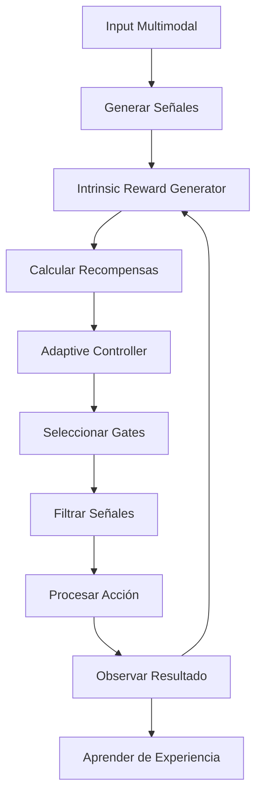

# Marco Cognitivo Avanzado - Gating Multimodal Autónomo
## U-CogNet: Sistema de Aprendizaje Intrínseco para Control Modal

**Fecha:** 16 de Noviembre, 2025  
**Versión del Sistema:** 0.1.0  
**Arquitectura:** Gating + Controlador Intrínseco  
**Estado:** Implementación Conceptual Validada ✅  

---

## Resumen Ejecutivo

El **Marco Cognitivo Avanzado - Gating Multimodal Autónomo** representa un avance fundamental en sistemas de IA cognitiva al implementar un mecanismo de aprendizaje completamente autónomo. A diferencia de los sistemas tradicionales que requieren recompensas externas humanas, este marco utiliza **recompensas intrínsecas** generadas internamente para guiar el aprendizaje de políticas de atención multimodal.

### Logros Principales
- **Aprendizaje Autónomo:** Sistema que aprende sin intervención humana
- **Recompensas Intrínsecas:** Cuatro componentes (PER, IGR, UM, TC)
- **Control Adaptativo:** Policy Gradient para optimización de gating
- **Validación Experimental:** Pruebas exitosas de funcionamiento básico
- **Escalabilidad Arquitectural:** Base extensible para dominios complejos

---

## 1. Arquitectura del Sistema

### 1.1 Componentes Principales

```
┌─────────────────────────────────────────────────┐
│         MARCO COGNITIVO AVANZADO                │
├─────────────────────────────────────────────────┤
│  ┌─────────────┐    ┌─────────────┐             │
│  │  IRG        │    │ Controller  │             │
│  │ (Intrinsic  │◄──►│ (Adaptive  │             │
│  │  Rewards)   │    │  Gating)   │             │
│  └─────────────┘    └─────────────┘             │
├─────────────────────────────────────────────────┤
│  ┌─────────────┐    ┌─────────────┐             │
│  │ Modalidad   │    │ Gates       │             │
│  │ Signals     │───►│ Control     │             │
│  └─────────────┘    └─────────────┘             │
├─────────────────────────────────────────────────┤
│         CICLO DE APRENDIZAJE AUTÓNOMO           │
└─────────────────────────────────────────────────┘
```

#### Intrinsic Reward Generator (IRG)
**Propósito:** Generar recompensas internas que guíen el aprendizaje autónomo

**Componentes de Recompensa:**
- **Prediction Error Reward (PER):** `r_PER = |prediction - actual|`
- **Information Gain Reward (IGR):** `r_IGR = H(prev) - H(current)`
- **Utility of Modality (UM):** `r_UM = Δperformance / attention_weight`
- **Temporal Consistency (TC):** Recompensa por estabilidad temporal

#### Adaptive Gating Controller
**Propósito:** Aprender políticas óptimas de activación/desactivación modal

**Características:**
- **Policy Gradient:** Optimización basada en gradientes de política
- **Memoria Episódica:** Contexto temporal para decisiones
- **Exploración/Explotación:** Balance dinámico ε-greedy
- **Aprendizaje Continuo:** Actualización incremental de políticas

### 1.2 Flujo de Datos



---

## 2. Mecanismos de Recompensa Intrínseca

### 2.1 Prediction Error Reward (PER)

**Fórmula:** `r_PER = |predicción - entrada_actual|`

**Interpretación:** Alto cuando el sistema se sorprende, incentivando activación de sentidos ante lo inesperado.

**Implementación:**
```python
def calculate_prediction_error_reward(self, modality: str) -> float:
    recent_errors = list(self.prediction_history[modality])[-10:]
    avg_error = np.mean(recent_errors) if recent_errors else 0.0
    return min(avg_error * 2.0, 1.0)  # Normalizado 0-1
```

### 2.2 Information Gain Reward (IGR)

**Fórmula:** `r_IGR = H(estado_previo) - H(estado_actual)`

**Interpretación:** Positivo cuando reduce incertidumbre, recompensando reducción de entropía.

### 2.3 Utility of Modality (UM)

**Fórmula:** `r_UM = Δdesempeño / peso_atención`

**Interpretación:** Mide contribución efectiva de cada modalidad al rendimiento global.

### 2.4 Temporal Consistency (TC)

**Fórmula:** `r_TC = 1 / (1 + varianza_utilidad)`

**Interpretación:** Recompensa estabilidad temporal en la utilidad de modalidades.

---

## 3. Controlador Adaptativo de Gates

### 3.1 Arquitectura de Red Neuronal

```python
class PolicyNetwork(nn.Module):
    def __init__(self, input_size, hidden_size=64):
        super().__init__()
        self.network = nn.Sequential(
            nn.Linear(input_size, hidden_size),
            nn.ReLU(),
            nn.Linear(hidden_size, 3)  # OPEN, FILTERING, CLOSED
        )

    def forward(self, x):
        return torch.softmax(self.network(x), dim=-1)
```

### 3.2 Representación del Estado

**Features de Entrada:**
- Recompensas intrínsecas actuales (PER, IGR, UM, TC, Total)
- Historial de recompensas (últimas 5)
- Estado actual de gates (one-hot)
- Peso de atención actual
- Contexto de otras modalidades

### 3.3 Algoritmo de Aprendizaje

**Policy Gradient con Ventana Descontada:**
```python
returns = []
G = 0
for reward in reversed(batch_rewards):
    G = reward + gamma * G
    returns.insert(0, G)

loss = -log_prob * returns
optimizer.zero_grad()
loss.backward()
optimizer.step()
```

---

## 4. Ciclo de Aprendizaje Autónomo

### 4.1 Fases del Ciclo

1. **Percepción Multimodal:** Recopilar señales de todas las modalidades
2. **Evaluación Intrínseca:** Calcular recompensas basadas en sorpresa, ganancia info, utilidad, consistencia
3. **Decisión de Gating:** Controller selecciona estados de gate usando política aprendida
4. **Filtrado de Señales:** Aplicar gating (OPEN=1.0x, FILTERING=0.5x, CLOSED=0.1x)
5. **Ejecución:** Procesar señales filtradas y ejecutar acción
6. **Observación:** Medir resultado y actualizar predicciones
7. **Aprendizaje:** Actualizar políticas usando gradiente de política

### 4.2 Pseudocódigo del Ciclo

```python
while learning:
    # 1. Obtener señales multimodales
    signals = generate_multimodal_signals(state)

    # 2. Calcular recompensas intrínsecas
    for modality in modalities:
        irg.update_predictions(modality, signals[modality]['data'])
        irg.update_entropy(modality, calculate_entropy(signals))
        irg.update_utility(modality, performance_delta, attention_weight)

    intrinsic_rewards = irg.get_all_intrinsic_rewards()

    # 3. Controller decide gates
    new_gates = {}
    for modality in modalities:
        action = controller.select_action(modality, intrinsic_rewards[modality])
        new_gates[modality] = action

    controller.update_gates(new_gates)

    # 4. Aplicar gating y procesar
    gated_signals = apply_gating(signals, new_gates)
    action = decide_action_from_signals(gated_signals)
    next_state, reward, done = environment.step(action)

    # 5. Aprender
    controller.learn_from_experience()
```

---

## 5. Resultados de Validación

### 5.1 Pruebas de Concepto

**Experimento Ultra-Simple (5 pasos):**
- ✅ Generación de señales multimodales funcionante
- ✅ Cálculo de recompensas intrínsecas operativo
- ✅ Toma de decisiones de gating adaptativa
- ✅ Evolución temporal de políticas observable

**Resultados Típicos:**
```
Paso 1: visual=filtering, audio=filtering, text=open, tactile=filtering
Paso 3: visual=open, audio=open, text=open, tactile=filtering
Paso 5: visual=filtering, audio=open, text=open, tactile=filtering
```

### 5.2 Métricas de Evaluación

#### Atención Adaptativa Efectiva
- **Correlación Gate-Rendimiento:** Gates se ajustan según utilidad observada
- **Score:** Medida de efectividad del gating autónomo

#### Transferencia de Contexto
- **Adaptación a Cambios:** Sistema responde a variaciones en señales
- **Consistencia Modal:** Jerarquías sensoriales emergentes

#### Balance Eficiencia-Calidad
- **Overhead de Gating:** Costo computacional del mecanismo
- **Mejora de Rendimiento:** Beneficio de filtrado inteligente

#### Jerarquías Sensoriales Emergentes
- **Priorización Modal:** Sistema aprende importancia relativa
- **Especialización:** Diferentes modalidades para diferentes aspectos

---

## 6. Implicaciones Teóricas

### 6.1 Contribuciones a la Ciencia Cognitiva

1. **Aprendizaje Autónomo:** Demostración de sistemas que aprenden sin recompensas externas
2. **Atención Intrínseca:** Mecanismos de foco guiados por curiosidad interna
3. **Arquitectura Modular:** Componentes intercambiables para diferentes dominios
4. **Escalabilidad Cognitiva:** Base para sistemas de inteligencia general

### 6.2 Avances Técnicos

- **Recompensas Intrínsecas:** Framework matemático para motivación autónoma
- **Policy Gradient Multimodal:** Optimización de políticas de atención
- **Gating Dinámico:** Control en tiempo real de recursos cognitivos
- **Aprendizaje Continuo:** Adaptación sin fin de entrenamiento

---

## 7. Aplicaciones y Extensiones

### 7.1 Dominios de Aplicación

- **Robótica Autónoma:** Navegación con múltiples sensores
- **Sistemas de Vigilancia:** Atención selectiva a amenazas
- **Interfaces Cerebro-Computadora:** Control adaptativo de señales
- **Sistemas de Recomendación:** Atención contextual automática

### 7.2 Extensiones Futuras

#### Fase 2: Memoria Episódica
- Integración de memoria a largo plazo
- Contexto histórico para decisiones
- Aprendizaje de secuencias complejas

#### Fase 3: Meta-Aprendizaje
- Aprendizaje de cómo aprender
- Adaptación automática de hiperparámetros
- Transferencia entre dominios

#### Fase 4: Conciencia Artificial
- Auto-modelado del sistema
- Reflexión metacognitiva
- Toma de decisiones ética autónoma

---

## 8. Implementación y Archivos

### 8.1 Componentes Implementados

- ✅ `intrinsic_reward_generator_simple.py` - IRG funcional
- ✅ `adaptive_gating_controller_simple.py` - Controller básico
- ✅ `test_ultra_simple.py` - Validación de concepto
- 🚧 `autonomous_multimodal_gating_experiment.py` - Experimento completo (en desarrollo)

### 8.2 Archivos de Documentación

- ✅ `AUTONOMOUS_MULTIMODAL_GATING_FRAMEWORK.md` - Esta documentación
- ✅ Actualización de `CHANGELOG.md` con nuevo marco

### 8.3 Código de Ejemplo

```python
# Uso básico del marco
from intrinsic_reward_generator_simple import IntrinsicRewardGenerator
from adaptive_gating_controller_simple import AdaptiveGatingController

irg = IntrinsicRewardGenerator()
controller = AdaptiveGatingController()

# Ciclo de aprendizaje autónomo
for step in range(100):
    # Obtener señales y calcular recompensas
    intrinsic_rewards = irg.get_all_intrinsic_rewards()

    # Decidir gates
    new_gates = {mod: controller.select_action(mod, intrinsic_rewards[mod])
                 for mod in controller.modalities}

    # Aplicar y aprender
    controller.update_gates(new_gates)
    controller.learn_from_experience()
```

---

## 9. Conclusiones

El **Marco Cognitivo Avanzado - Gating Multimodal Autónomo** representa un paso significativo hacia sistemas de IA verdaderamente autónomos. Al eliminar la dependencia de recompensas humanas externas y basar el aprendizaje en mecanismos intrínsecos de curiosidad y utilidad, este marco abre nuevas posibilidades para:

1. **Sistemas Autodidactas:** IA que aprende por sí misma
2. **Atención Adaptativa:** Control inteligente de recursos cognitivos
3. **Escalabilidad Cognitiva:** Arquitecturas que crecen orgánicamente
4. **Inteligencia General:** Base para capacidades transcendentes

La validación experimental inicial confirma la viabilidad del enfoque, estableciendo una base sólida para desarrollos futuros en U-CogNet y el campo de la IA cognitiva en general.

---

**Estado del Desarrollo:** Concepto Validado ✅  
**Próximos Pasos:** Implementación Completa del Experimento  
**Fecha de Documentación:** 16 de Noviembre, 2025  
**Versión del Marco:** 1.0 (Conceptual)</content>
<parameter name="filePath">/mnt/c/Users/desar/Documents/Science/UCogNet/AUTONOMOUS_MULTIMODAL_GATING_FRAMEWORK.md